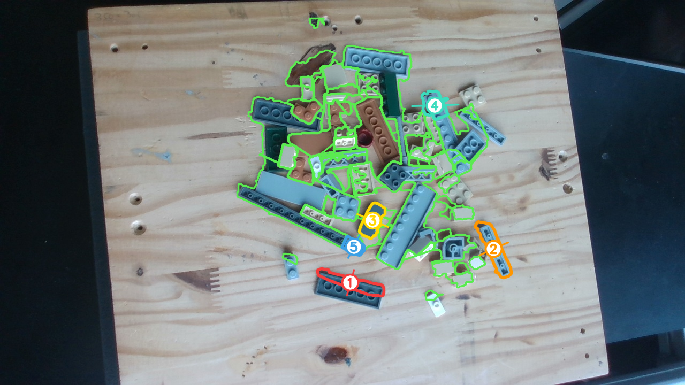

# Lego bin picking — IDLab-AIRO summer internship

Bachelor's internship at **IDLab-AIRO, UGent**, 1 Jul – 26 Aug 2026.

Empty a pile of unsorted lego bricks one brick at a time, then sort what comes out by shape and
colour. [PLAN.md](PLAN.md) has the module breakdown and where each one stands.

| | |
|---|---|
| Arms | Universal Robots UR3e, Realman RM75 |
| End effectors | Robotiq 2F-85, BrainCo Revo2 dexterous hand |
| Camera | Intel RealSense RGB-D, wrist mounted |

---

## Perception — finding the bricks and choosing which to pick



This is where the project makes its decisions. One camera frame goes in; out comes every brick in
the pile, measured in the robot's base frame and ranked by how safely a top-down parallel-jaw grasp
would work. The picture above is that output on a real pile: green outlines are the regions found to
be bricks, the numbers are the five best grasps in order, and the bar drawn across each numbered
brick is the direction the jaws close.

Two implementations, same interface, same pipeline:

| | |
|---|---|
| **[`src/m1/perception_rgbd.py`](src/m1/perception_rgbd.py)** | Colour **and depth**, measured against the tabletop the arm touched off. What the simulator runs, and what the bench runs standalone. |
| [`src/m1/perception_rgb.py`](src/m1/perception_rgb.py) | Colour only. Runs on a still photograph with no robot attached, which makes it the one that can be tuned offline. Drops the two scoring terms that need depth and reweights the rest. |

### The RGB-D pipeline

`analyse_pile()` in `perception_rgbd.py`, seven stages:

| stage | what it does |
|---|---|
| `build_scene` | Back-projects every pixel through the hand-eye calibration into the base frame, and turns depth into height above the touched-off table plane. Thresholds below are in millimetres, converted to pixels at runtime from `f / Z`, so 720p and 1080p behave the same. |
| `build_table_model` | Pixels within 1.5 mm of the plane are known-bare tabletop. They seed a per-pixel colour model of the wood, so grain and knots are *learned* from the frame rather than thresholded out of it. |
| `segment_foreground` | Hysteresis on two cues at once: height (2.5 mm strong, 1.0 mm weak — set by the 3.2 mm plate, the thinnest part in the set) and colour distance in sigmas of the table's own scatter. Colour carries the pixels where stereo depth drops out, which is brick edges, dark plastic and anything glossy. |
| `segment_instances` | Watershed over a gradient built from colour edges *and* height steps, then merge and split rounds until one brick is one region. A stack of two reads as a height step; two bricks side by side read as a colour edge. |
| `build_bricks` | Per region: minimum-area rectangle projected onto the plane of its own top face, giving width, length, height and long-axis heading in millimetres; colour named from a palette; and a confidence that answers whether this is a brick at all or a knot in the plywood. |
| `measure_clearance` | Rasterises every footprint onto a 1 mm top-down map of the table and measures the bare table beside each brick's grasp faces. Done in millimetres, not pixels, because a pixel at the top of the frame is not the same size as one at the bottom. |
| `rank_bricks` | Weighted score per brick, best first. `assign_priorities` then numbers the top five, dropping any the detector is unsure of, any whose geometry is not a grasp, and any the arm cannot reach a straight-down pregrasp above (IK, capped at 12 checks). |

### What comes out per brick

Position in the base frame, top-face height above the table, width × length in millimetres, long-axis
heading, colour name, a confidence with the cue it came from, the grasp score with its per-term
breakdown, fingertip clearance, and — for regions that were dropped — the reason why. `Brick` in
`perception_rgbd.py` is the full record.

### How a grasp is scored

Every term answers some version of "will the fingers actually get around this one". `SCORE_WEIGHTS`:

| term | weight | |
|---|---|---|
| `clearance` | 0.28 | room for the fingertips beside the brick — the thing that fails first |
| `top_of_pile` | 0.20 | nothing standing over it, straight off the height map |
| `grip_depth` | 0.18 | how far down its side the fingertips reach before the table stops them |
| `isolation` | 0.14 | distance from the rest of the pile |
| `confidence` | 0.14 | how sure the detector is this is a brick and not the table |
| `exposure` | 0.10 | how much of its outline borders bare table rather than another brick |
| `visibility` | 0.08 | a clean rectangle is a brick nothing is lying across |
| `width_fit` | 0.08 | short side comfortably inside the gripper's 85 mm stroke |
| `size` | 0.06 | a whole brick rather than the corner of one |

`grip_depth` is there because without it the ranking sends the arm at the hardest grasps first: a
plate alone on bare table scores full marks on everything else, and offers 1.7 mm of side wall to
close on.

### Running it

Against the camera. Moves to the pile viewpoint, looks, reports, and writes the overlay, the stage
panel, the manifest and the raw capture — `--no-write` keeps it from handing a target downstream:

```bash
python src/m1/perception_rgbd.py --debug-dir run/perception --no-write
```

Replay a saved capture with no hardware at all, which is how the thresholds get tuned:

```bash
python src/m1/perception_rgbd.py --from-capture run/perception/pile_20260810_150307_capture.npz
```

RGB only, on the photographs in [`lego_pic/`](lego_pic):

```bash
python src/m1/perception_rgb.py --debug
```

### Why the bench pipeline currently runs the RGB path

`m1/physical/submodule_1.py` captures depth with every frame and then ignores it, using
`perception_rgb` for segmentation. The reason is calibration, not perception: every height in the
RGB-D path is measured against one plane, so a constant offset between the camera's idea of the
tabletop and the arm's — a hand-eye calibration still settling is enough — makes bare plywood read as
standing proud, and the pipeline then reports wood instead of bricks. Colour only asks whether a
pixel looks like the tabletop, which no calibration error changes.

The cost is height, which the RGB path looks up in the part catalogue
([`common/lego_catalog.py`](src/common/lego_catalog.py), measured off the meshes in
[`lego_3d/`](lego_3d)) when a footprint matches, instead of measuring it.
[`src/tools/diagnose_table.py`](src/tools/diagnose_table.py)
measures how far off the calibration is, and the RGB-D path goes back in when that number comes down.
The simulator runs the RGB-D path unchanged, where the hand-eye transform is exact.

---

## Layout

```text
src/
  common/          shared libraries — imported, never run
    config.py          robot, camera and calibration constants; connections
    lego_catalog.py    part catalogue: meshes, footprints, footprint matching
    scene.py           Drake scene building (arm, gripper, meshcat)
  m1/              module 1 — grasp one brick from the pile
    perception_rgbd.py   RGB-D pile perception: segment, measure, score
    perception_rgb.py    RGB-only pile perception, runs on a still photograph
    simulation/          Drake + Meshcat: world.py, submodule_1.py, submodule_2.py, main.ipynb
    physical/            the bench: cell.py, submodule_1.py, submodule_2.py, main.ipynb
  m0/              module 0 — command the BrainCo Revo2 hand directly (simulation/, physical/)
  tools/           command-line utilities, run by hand
    calibrate_table.py     touch the tabletop with the arm and fit a plane — run this first
    capture.py             grab frames from the wrist camera
    diagnose_table.py      why the perception cannot find bare table, per viewpoint
    verify_pick_accuracy.py  measure how far the perception's brick is from the real one
    measure_table_z.py     cross-check hand-eye against the board (superseded for table height)
    teach_pose.py          freedrive the arm and print where it ended up
  assets/          URDFs and meshes: ur3e, robotiq_2f_85, rm75, revo2

lego_3d/           lego part meshes and URDFs, built from the LDraw parts library
lego_pic/          photographs of the pile, the RGB perception's input
calibration_dir/   hand-eye calibration output for this bench
docs/              figures used here
```

Everything puts `src/` on `sys.path` and imports as `common.config`, `m1.perception_rgbd`,
`m1.physical.cell`. Scripts run by path from the repo root: `python src/tools/calibrate_table.py`.

---

## Setup

Prerequisites: python 3.10, conda.

```bash
git clone --recurse-submodules https://github.com/chaseungjoon/internship-idlab-airo
cd internship-idlab-airo
conda env create -f environment.yaml
conda activate int2026
```

`airo-mono` is a submodule and gets installed editable, so run the env creation from the repo root.
If you cloned without `--recurse-submodules`: `git submodule update --init airo-mono`.

## Running M1

**Simulation** — a UR3e with a Robotiq 2F-85 and a wrist RealSense picking real lego parts out of a
flat pile, one survey at a time. Run the cells in order; it prints a Meshcat URL to watch in.

```bash
jupyter notebook src/m1/simulation/main.ipynb
```

**Bench** — calibrate the camera, then touch off the table once so the arm measures it, tilt included:

```bash
airo-camera-toolkit hand-eye-calibration --mode eye_in_hand --robot_ip=[ROBOT_IP]
python src/tools/calibrate_table.py
```

Then the notebook, which runs both submodules in one process:

```bash
jupyter notebook src/m1/physical/main.ipynb
```

Or two terminals, when you want to stop between the halves and look at what was chosen:

```bash
python src/m1/physical/submodule_1.py    # perceive the pile, choose a brick, stand over it
python src/m1/physical/submodule_2.py    # grasp it and lift it
```

Set `AIRO_CALIBRATION_DIR` to use a hand-eye calibration other than the one committed here.

## Running M0

The Revo2 hand on its own, in simulation and on hardware. Hardware needs the vendor SDK:

```bash
pip install bc-stark-sdk
jupyter notebook src/m0/simulation/hand_basics.ipynb
```
